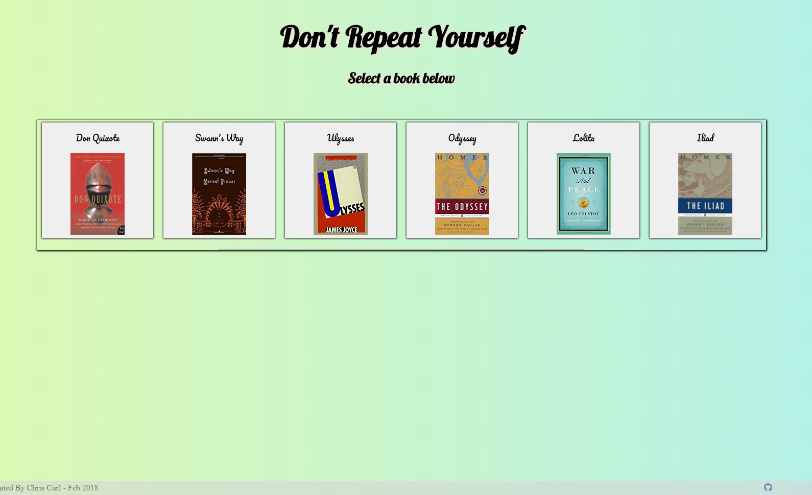

<b> DRY-Don't-Repeat-Yourself</b>

DRY is a software development principle which emphasizes brevity and concicesness when writing code. 
This application will show the most repeated words in several famous books.

